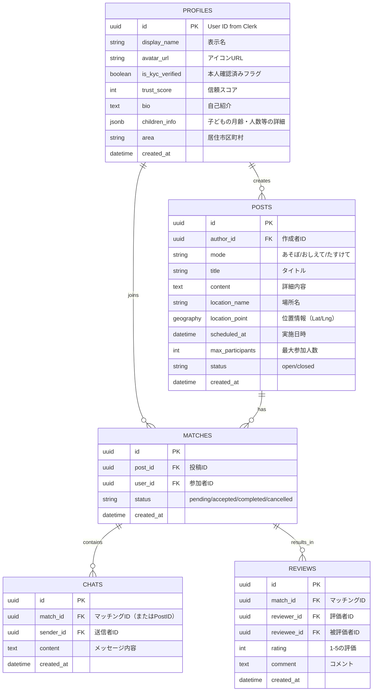

# データベース設計

## 1. 目的
MamaLinkの各機能（マッチング、交流、相談）を支える堅牢なデータ構造を定義します。

## 2. ER図

## 3. テーブル定義

### 3.1 `profiles`
Clerkの認証情報と紐づくユーザー詳細データ。
| カラム名 | 型 | 制約 | 説明 |
| :--- | :--- | :--- | :--- |
| id | uuid | PRIMARY KEY | Clerkのuser_id |
| display_name | string | NOT NULL | アプリ内での表示名 |
| avatar_url | string | | プロフィール画像 |
| is_kyc_verified | boolean | DEFAULT false | 本人確認ステータス |
| trust_score | int | DEFAULT 100 | 信頼スコア |
| children_info | jsonb | | 例: `{ count: 1, ages: [8] }` |
| area | string | | 居住市区町村 |

### 3.2 `posts`
募集投稿（あそぼ・おしえて・たすけて）。
| カラム名 | 型 | 制約 | 説明 |
| :--- | :--- | :--- | :--- |
| id | uuid | PRIMARY KEY | |
| author_id | uuid | FK (profiles.id) | |
| mode | string | CHECK (mode IN ('asobo', 'oshiete', 'tasukete')) | |
| location_point | geography | | 位置情報検索用 |
| scheduled_at | datetime | | 活動開始予定日時 |

### 3.3 `matches`
募集に対する応募とマッチング状態。
| カラム名 | 型 | 制約 | 説明 |
| :--- | :--- | :--- | :--- |
| id | uuid | PRIMARY KEY | |
| post_id | uuid | FK (posts.id) | |
| user_id | uuid | FK (profiles.id) | 参加者 |
| status | string | DEFAULT 'pending' | 'pending', 'accepted', 'completed' |

## 4. インデックス設計
- `posts.location_point`: GISTインデックス（位置情報検索の高速化）。
- `matches.post_id`, `matches.user_id`: 外来キーインデックス。
- `chats.created_at`: メッセージ取得順序の最適化。
