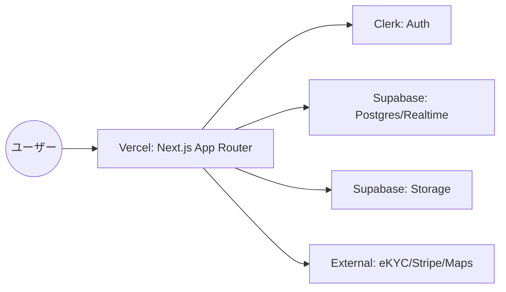
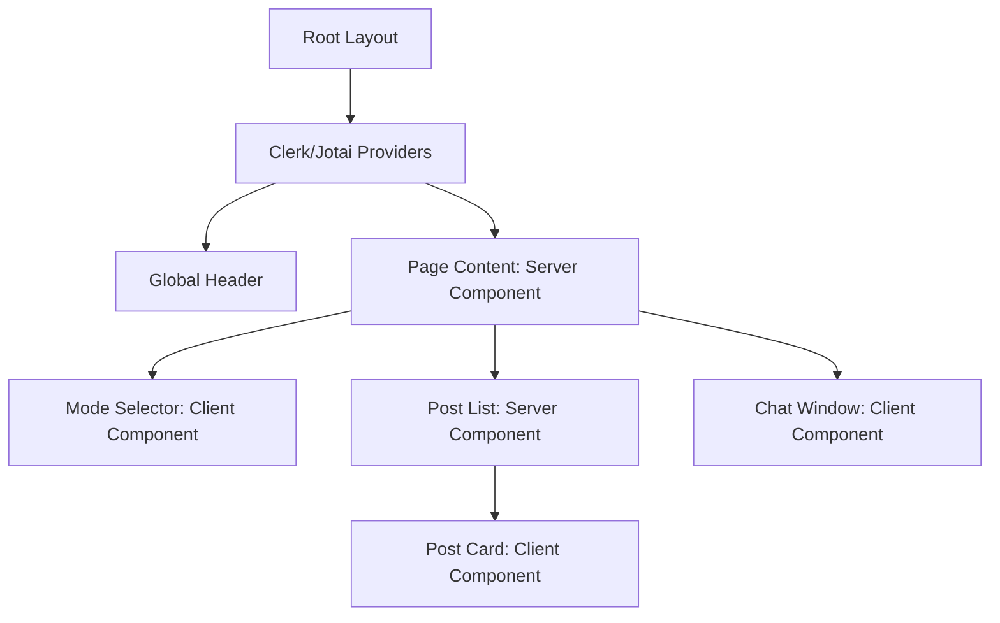

# システムアーキテクチャ設計

## 1. 目的
システム全体の技術構成とコンポーネント間の連携を明確にし、拡張性と保守性の高い基盤を定義します。

## 2. 技術スタック
| カテゴリ | 選定技術 | 選定理由 |
| :--- | :--- | :--- |
| フロントエンド | Next.js (App Router) | 高速な描画、SEO対応、開発効率の高さ。 |
| 言語 | TypeScript | 型安全性によるバグ防止と保守性の向上。 |
| 認証 | Clerk | 堅牢な認証、SNSログイン連携の容易さ、ユーザー管理の効率化。 |
| バックエンド/DB | Supabase (PostgreSQL) | リアルタイム通信（チャット）、ストレージ、Postgresの信頼性。 |
| ホスティング | Vercel | Next.jsとの親和性、CI/CDの自動化、スケーラビリティ。 |
| 状態管理 | Jotai / React Context | シンプルかつ軽量な状態管理。 |

## 3. アーキテクチャ概要図

### 各コンポーネントの役割
- **Vercel**: Next.jsアプリケーションの実行環境。エッジ関数や静的生成を組み合わせ、グローバルな高速アクセスを実現。
- **Next.js App Router**: フロントエンドおよびAPIルートの統合。Server Componentsを活用し、クライアント側のJS削減と高速な初期表示を実現。
- **Clerk**: ユーザー認証とセッション管理。本人確認（eKYC）ステータス等のメタデータ管理も一部担う。
- **Supabase**:
    - **PostgreSQL**: アプリケーションデータの永続化。
    - **Realtime**: チャットメッセージの即時配信。
    - **Storage**: プロフィール画像等の保存。
- **External API**: 決済（Stripe）、本人確認（eKYC）、地図情報（Google Maps）との連携。

## 4. コンポーネント設計
### コンポーネント階層図

### 主要コンポーネント定義
1. **PostList (Server Component)**
    - **役割**: Supabaseから最新の募集データを取得し、一覧を表示。
    - **Props**: `filter: { mode: string, location: string }`
2. **PostCard (Client Component)**
    - **役割**: 個別投稿の表示。詳細画面への遷移や、簡易なアクションを管理。
    - **Props**: `post: PostType`
3. **ChatWindow (Client Component)**
    - **役割**: Supabase Realtimeを使用したリアルタイムチャット。
    - **状態管理**: `messages: MessageType[]`, `isLoading: boolean`
    - **機能**: メッセージ送信、自動スクロール、新着通知。

## 5. 状態管理方針
- **グローバル状態**: Jotaiを使用。ユーザー設定や一時的なフィルター状態などを管理。
- **認証状態**: Clerkの `useAuth` フックを使用。
- **サーバーキャッシュ**: Next.jsの `fetch` キャッシュおよび `revalidate` タグを使用。
