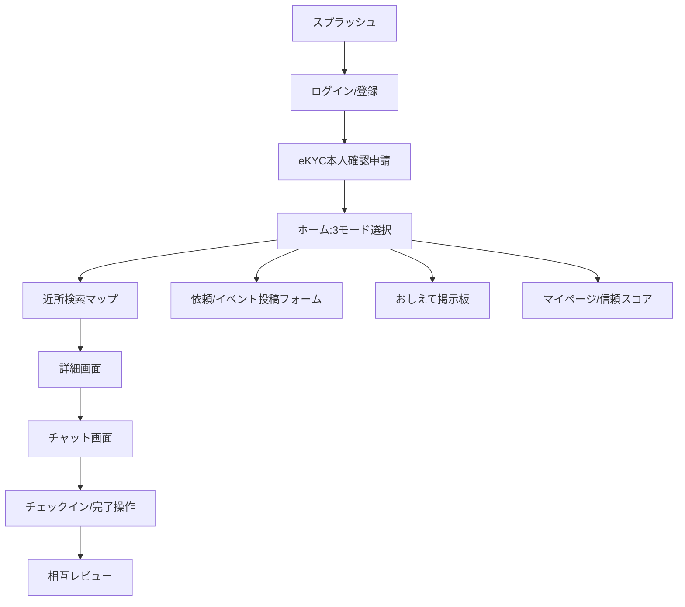

# UI/UX設計書

## 1. デザインコンセプト
「プロフェッショナルな信頼感と、飾らない清潔感」
怪しげなコミュニティ感を排除し、SlackやNotionのような洗練されたツールとしてのUIを提供します。

## 2. デザインシステム
### カラーパレット
- **Primary**: セージグリーン (#87A96B) - 安心、癒やし、育児のポジティブなイメージ。
- **Secondary**: テラコッタ (#E2725B) - 活動的、温かみ、アクセント。
- **Background**: オフホワイト (#FDFDFD) - 清潔感、可読性。
- **Text**: チャコールグレー (#333333) - 視認性の確保。

### タイポグラフィ
- **日本語**: Noto Sans JP (Medium/Regular)
- **英語**: Inter
- **方針**: 余白（White space）を大きく取り、視覚的ノイズを最小限にする。

## 3. 画面遷移図

## 4. 主要画面設計（ワイヤーフレーム詳細）

### 4.1 ホーム画面
- **ヘッダー**: 「MamaLink」ロゴ、地域名（例：世田谷区）、通知アイコン。
- **中央**: モード切り替えカード（たすけて・あそぼ・おしえて）を大きく配置。
- **リスト**: 「今から合流できる！」近所の投稿をタイムライン形式で表示。
- **タブバー**: ホーム、マップ、作成（＋）、マイページ。

### 4.2 依頼詳細・マッチング画面
- **上部**: マッププレビュー（場所の特定）。
- **中央**: 依頼者のカード（本人確認済みバッジ、共通の趣味、子どもの月齢）。「信頼スコア 125」と大きく表示。
- **詳細**: 依頼理由、場所の詳細（例：児童館の授乳室近く）、お礼の内容。
- **下部**: 「応募する」フローティングアクションボタン。

### 4.3 チャット画面
- **ヘッダー**: 相手の名前、マッチング内容。
- **アクションバー**: 「チェックイン（到着）」ボタン。
- **入力部**: 定型文（「向かってます」「到着しました」等）のショートカット機能。

## 5. UX原則
1. **信頼の可視化**: あらゆる場面で「本人確認済み」と「共通点」を強調し、心理的ハードルを下げる。
2. **2タップでのアクセス**: 主要機能へのアクセスを簡潔にし、忙しい育児中でも片手で操作可能にする。
3. **場（Venue）の推奨**: 家以外の公共施設を選択肢のトップに出し、一歩目を踏み出しやすくする。
