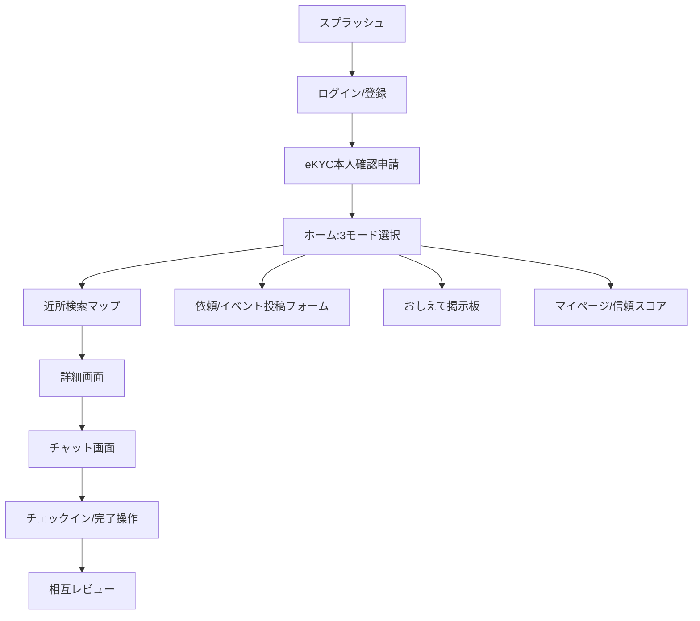
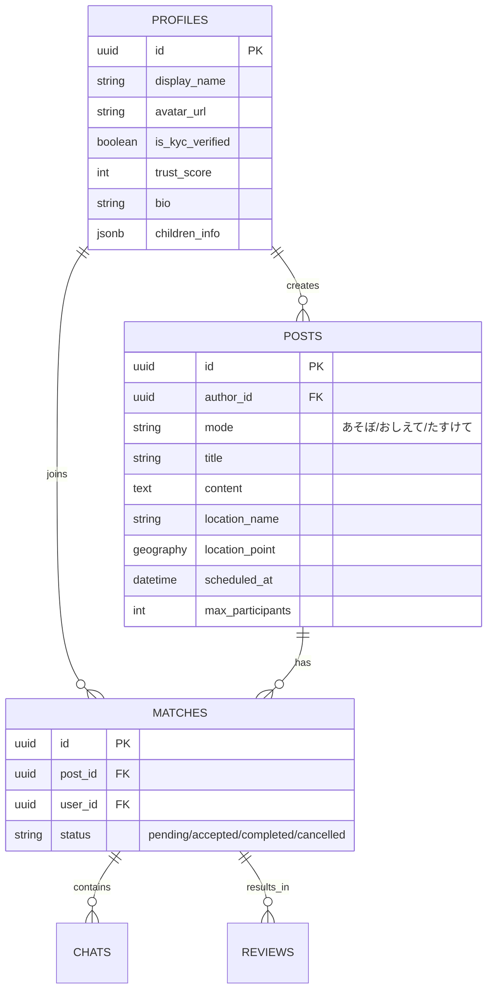
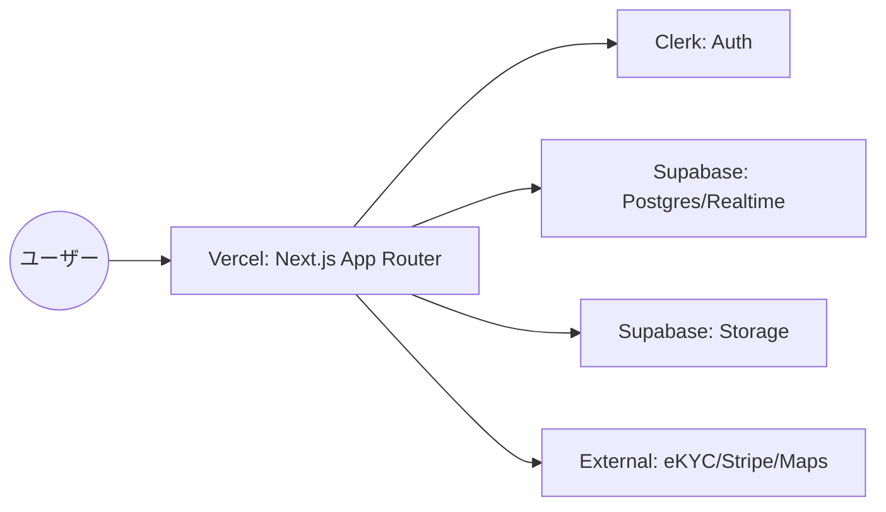
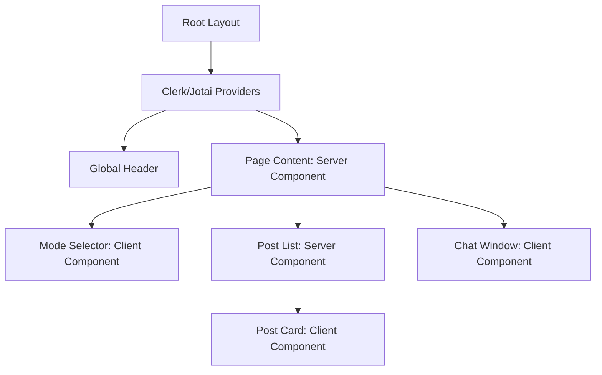

# 詳細要件定義書：MamaLink（ママリンク）

## 1. プロジェクト概要
MamaLinkは、現代の育児における「孤育て（孤独な育児）」を解消し、地域で助け合えるセーフティネットを構築するためのモバイルプラットフォームです。従来のシッターサービスとは異なり、「同じ空間にいながら、別のママに少しだけ手を貸してもらう」という心理的ハードルの低い助け合いを核としています。eKYCによる厳格な本人確認と、公共の場を活用したマッチングにより、信頼と安全を担保した新しい地域コミュニティを実現します。

## 2. ビジネス要件
### 2.1 リーンキャンバス要約
- **課題**: 突発的な育児の辛さ、頼ることへの罪悪感、既存サービスの予約制による柔軟性の欠如。
- **解決策**: ママ同士のリアルタイムな助け合いマッチング、公共の場でのグループ活動。
- **独自の価値提案**: 「お互い様」の関係性による罪悪感の払拭、eKYCによる安全性と「プロ感」のあるUX。
- **収益構造**: 広告、専門家相談サブスクリプション、決済手数料（デジタルギフト・有償依頼）。

### 2.2 KPI/KGI
- **KGI**: パイロットエリア内でのマッチング成立数（目標：リリース3ヶ月で月間500件）。
- **KPI**:
    - 月間アクティブユーザー数（MAU）。
    - ユーザーあたりの平均信頼スコア。
    - リピート利用率（2回以上マッチングしたユーザーの割合）。

## 3. ユーザー要件
### 3.1 ペルソナ
1. **佐藤 美咲（32歳）- 依頼側**
    - 状況：育休中のワンオペ育児。近所に頼れる親族がいない。
    - 悩み：睡眠不足で限界、大人と話したい。
2. **田中 裕子（38歳）- サポーター側**
    - 状況：子どもが小学生になり、時間に余裕ができた。
    - 動機：自分の経験を活かしたい、地域に貢献したい。

### 3.2 ユーザーストーリー
- 依頼者として、今すぐカフェで30分だけ子どもを見ていてほしい。
- 参加者として、近所の公園で同じ月齢の子を持つママと遊びたい。
- サポーターとして、信頼できる相手にだけ自分の空き時間を提供したい。
- ユーザーとして、eKYCによる本人確認済みバッジを見て安心して連絡を取りたい。

### 3.3 MVPの定義
- 必須機能：eKYC本人確認、3モード（あそぼ・おしえて・たすけて）、場所指定マッチング、1対1/グループ募集、チャット、相互レビュー。
- 非必須：高度なAIマッチング、エリアアンバサダー、企業クーポン。

## 4. 機能要件
### 4.1 機能一覧 (MoSCoW)
- **Must Have**:
    - eKYC本人確認連携
    - 3モード切り替えホーム画面
    - 場所（公共施設・カフェ）指定投稿
    - グループマッチング
    - リアルタイムチャット
    - 相互レビュー・信頼スコア
- **Should Have**:
    - デジタルギフト送付機能
    - 活動付帯保険の自動適用
    - AIメッセージフィルタリング
- **Could Have**:
    - 専門家（助産師等）へのチャット相談
    - エリア限定お知らせ通知
- **Won't Have**:
    - 複雑な広告管理システム（初期は静的配置）

### 4.2 機能詳細仕様
1. **たすけてマッチング**
    - ユースケース：依頼者が日時・場所・内容を入力し募集。候補者の中から1人（または複数）を選び、合流してチェックイン。
    - 正常系：募集 → 応募 → 承認 → チャット → チェックイン → 完了 → レビュー。
    - 例外系：マッチング後のキャンセル（ペナルティあり）、チェックイン忘れの通知。
2. **信頼スコアシステム**
    - 仕様：本人確認済み、レビュー平均点、マッチング回数から算出。
    - UI要件：プロフィール画面に大きくバッジとスコアを表示。

## 5. UI/UX設計
### 5.1 デザインコンセプト
- **コンセプト**: 「清潔感、信頼感、プロフェッショナル」
- **カラーパレット**:
    - メイン: セージグリーン (#87A96B)
    - アクセント: テラコッタ (#E2725B)
    - ベース: オフホワイト (#FDFDFD)

### 5.2 画面遷移図

### 5.3 ワイヤーフレーム（テキスト）
- **ホーム画面**: 上部にモード切り替え（タブ形式）、中央に近所の新着投稿（カード形式）、下部にタブバー（ホーム、マップ、通知、プロフィール）。
- **依頼詳細画面**: 上部に地図と場所名、中央に依頼者の信頼スコアとプロフィール、下部に「応募する/チャットする」ボタン。

## 6. 非機能要件
- **パフォーマンス**: 主要画面のLCP 2.5s以内、APIレスポンス 500ms以内。
- **セキュリティ**: 個人情報のSupabase暗号化保存、Clerkによるセキュア認証。
- **可用性**: 稼働率 99.9%（Vercel/SupabaseのSLAに準拠）。

## 7. データベース設計
### 7.1 ER図

## 8. インテグレーション要件
- **外部サービス**: eKYC API (TRUSTDOCK等), Stripe (決済), Google Maps API (地図).
- **API仕様 (仮)**:
    - `POST /api/matches`: マッチング申請（リクエスト: post_id, message）。
    - `GET /api/posts/nearby`: 近隣の投稿取得（クエリ: lat, lng, radius）。

## 9. 技術選定とアーキテクチャ
### 9.1 アーキテクチャ概要図

### 9.2 コンポーネント階層図

## 10. リスクと課題
- **法的リスク**: マッチング時の事故。対策：活動付帯保険の自動適用。
- **ビジネスリスク**: ユーザー獲得コスト（CAC）の高騰。対策：地域密着型のオフライン施策。

## 11. ランニング費用と運用方針 (仮定)
- **インフラ**: Vercel ($20/mo~), Supabase (Free~Pro $25/mo), Clerk (Free~).
- **外部API**: eKYC手数料 (約200-500円/回), Stripe手数料 (3.6%).
- **運用**: 24時間通報監視は初期はAI＋自動フィルタリング、成長に合わせてアウトソース。

## 12. 変更管理
- 要件変更はGitHubのIssueで管理し、アーキテクチャに影響する場合はドキュメントを即時更新する。

## 13. 参考資料
- `/docs/input/business-requirements.md`
- `/docs/input/product-requirements.md`
- `/docs/input/user-personas.md`
- `/docs/input/user-flows.md`
- `/docs/input/feature-list.md`
- `/docs/input/mvp-scope.md`
- `/docs/input/ui-ux-direction.md`
